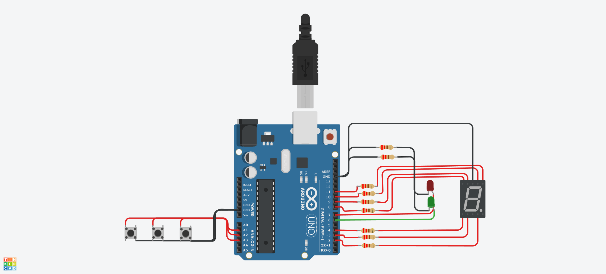

# Parcial_SPD

## Integrantes 
- Diego Uthurburu

## Proyecto: ASCENSOR.

## Descripción
Permita al usuario saber a qué estación de subte está
llegando, aparte el sistema muestra las estaciones que faltan hasta llegar a destino,
para ello debemos utilizar 4 LEDs y el display de 7 segmentos. Esta vez el buzzer
deberá emitir un sonido diferente cada vez que se llegue a una estación.
El sistema deberá arrancar apagado, luego de presionar el botón empezará y hará lo
pedido.

## Funciónes principales
Estas funciones se encargan de encender y apagar los leds.

 PULSADOR, CONSTITUCION, SAN_JUAN, INDEPENDENCIA, MORENO, A, B, C, D ,E, F, G,
 son #define que utilizamos para agregar los leds y Piezo o Buzzer , asociandolo a pines de la placa arduino.

(Esta funcion se encarga de prender los Led )

~~~ C++ (lenguaje en el que esta escrito)
void prender(int led)
{
	  digitalWrite(led, HIGH);
}
~~~
(Esta funcion se encarga de apagar los Led )

~~~ C++ (lenguaje en el que esta escrito)
void apagar(int led)
{
	  digitalWrite(led, LOW);
}
~~~

  (Esta funcion se encarga de prender los led del Visualizador de 7 segmentos)
~~~ C++ (lenguaje en el que esta escrito)
void mostrar_numeros(int a, int b, int c, int d, int e, int f, int g)
{
    digitalWrite(A,a);
    digitalWrite(B,b);
    digitalWrite(C,c);
    digitalWrite(D,d);
    digitalWrite(E,e);
    digitalWrite(F,f);
    digitalWrite(G,g);

}
~~~

## :robot: Link a los proyectos

- Matias Cuervo [ver proyecto](https://www.tinkercad.com/things/bAElv6KhMQH-super-jaiks-bojo/editel?sharecode=_bEp5xSMT9GE03Re8AFTyAgs6JiUbeiaR-w2N7AYkaI)
- Lucas Da Silva Pinheerio [ver proyecto](https://www.tinkercad.com/things/hFFKjrnNKA3-powerful-densor-habbi/editel?sharecode=hSLlfDFcg9naeE9PNOc5Mizxp4aGDO9vrusrS3fZ20o)
- Agustin Di Leone [ver proyecto](https://www.tinkercad.com/things/fROji6YbE7s-super-trug/editel?sharecode=7sJjtdV6HB2lzgoVJFzteLHUV6UUO2PUq_lvnrYaJLY)
- Belén Funtanillas [ver proyecto](https://www.tinkercad.com/things/cbClac6TBhj-funtanillas-belen-dojo-2/editel?sharecode=mC3mi5-8cOSdtYWYRv6VCc67MJv2ODE3r7J-gGHUJvc)
- Diego Uthurburu [ver proyecto](https://www.tinkercad.com/things/hX1LppnI35c-dojo-numero-dos/editel?sharecode=I-6krSOhWYcZn9OcA2VhyUUXisVNMirJE0aSpEEiqvc)
- Adolfo Pumacayo [ver proyecto](https://www.tinkercad.com/things/iMaFKBlFCc5-stunning-densor/editel?sharecode=kxRxVRCvJHJQY_ZVGjSsjcSrPH5rgW8zqhATnLypyxo)
## :tv: Link al video del proceso
- [video](https://www.youtube.com/watch?v=VyGjE8kx-O0)

---
### Fuentes
- [Consejos para documentar](https://www.sohamkamani.com/how-to-write-good-documentation/#architecture-documentation).

- [Lenguaje Markdown](https://markdown.es/sintaxis-markdown/#linkauto).

- [Markdown Cheatsheet](https://github.com/adam-p/markdown-here/wiki/Markdown-Cheatsheet).

- [Tutorial](https://www.youtube.com/watch?v=oxaH9CFpeEE).

- [Emojis](https://gist.github.com/rxaviers/7360908).

---
